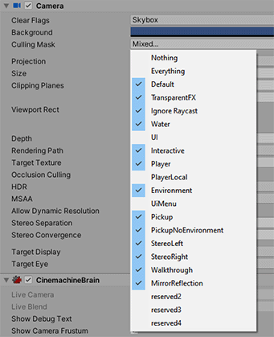

# CameraWorks
**CameraWorks** is a set of 3rd-person camera prefabs for VRChat world creation, designed to help make performing/streaming in VRChat easier, especially for solo creators.

[Preview video via Youtube](./docs/fisheyepreview.png)

## Setup
### Requirements
- Unity 2019.4.31f1
- [VRChat SDK3 Worlds](https://vrchat.com/home/download)
- [UdonSharp](https://github.com/vrchat-community/UdonSharp)

### Getting Started
1. Import VRChat SDK3 Worlds & UdonSharp
2. [Set up layers to match VRChat](https://docs.vrchat.com/docs/creating-your-first-world#step-4---setting-up-the-scene)
3. Import CameraWorks unitypackage into your project
4. Open the CameraWorksDemo scene, or drag any of the prefabs into your existing scene

#### Demo Scene Controls
By default, Alpha '0' key to enable camera output in desktop window. 'B'/'N' to switch between previous/next cameras respectively, and 'H' to enable camera autopilot.

## Features

* **3rd-person/World Multicamera**: Cut between multiple 3rd-person cameras in desktop window

* **Autopilot**: Timer-based, automatic camera transitions.

* **Fade/Dissolve Transitions**: Dissolve between two different cameras.

* **Fisheye Lens**: 180, 210 and 240 degree fisheye lenses.

CameraWorks has prefabs supporting both [Cinemachine](https://unity.com/unity/features/editor/art-and-design/cinemachine) cameras (recommended) and regular Unity cameras.

### Limitations
* Currently, networking / Udon sync is not implemented.
* Fisheye and fade transitions require rendering multiple camera views, so the performance cost is quite high.

## Troubleshooting

**UI / Menu elements are visible in the output camera**: Check the `Culling Mask` layers on your Output Camera. `UI`, `UI Menu` and `Player Local` should be disabled. Additionally, `reserved1-3` should be disabled if running in desktop (non-VR) mode.

**No output in desktop window when enabling output camera**: Make sure the Final Output Camera has the highest `Depth` in the scene (default 100 is the highest), and set `Target Eye = None (Main Display)`. You may need to keep the Camera disabled by default, otherwise it gets removed by VRC when loading the world.

**Projection mode is wrong when mixing Fisheye and regular cameras**: Make sure *all* CinemachineVirtualCameras have Mode Override set (CinemachineVirtualCamera > Lens > Advanced). Orthographic for Fisheye, Perspective for regular camera.

**Performance tips**:
* Make sure Fisheye cameras & output cameras are disabled when not in use.
* Use 4-camera Fisheye (max angle of 180 degrees, but requires one less camera & RenderTexture).
* Reduce the resolution of the Fisheye RenderTextures.
* If you are not using Fade transitions, use the Unity/Cinemachine Multicam, as it does not need to use a RenderTexture.

## Guides

### Multicam Settings Explanation

#### Cameras
| Setting | Description |
| ------- | ----------- |
| Cameras | Array of all Unity/CinemachineVirtualCameras use. |
| Fade Time | Duration of fade transition, in seconds. |

#### Advanced Settings
| Setting | Description |
| ------- | ----------- |
| Output Camera | Camera used to display output desktop window. Toggled by 'Enable Output Key'. Must have higher `Depth` than Main Camera, with `Target Eye = None (Main Display)`. |
| Disable After Transition | List of additional GameObjects to disable after transition. Use to disable  Fisheye cameras when not in use for performance. |
| Active Camera | |
| Fade Target Camera | |
| Fade Target Material | Material used to overlay incoming fade camera's RenderTexture. Should match `Fade Target RenderTex`'s material. |
| Active Layer | Layer index for main CinemachineBrain. Should be different from VRChat's layers, as it will be added to the camera's culling mask | 
| Fade Target Layer | Layer index for incoming camera's CinemachineBrain. Must be different to ActiveLayer. This will also be added to the camera's culling mask |

 #### Autopilot
| Setting | Description |
| ------- | ----------- |
| Target  | UdonBehavior controlling scene cameras. Will receive OnNextCamera and OnRandomCamera events. |
| Autopilot | Enable automatic camera transition. |
| Random Order | Randomize order of automatic transitions. |
| Enable Autopilot Key | |
| Speed | Length of time between transition. Must be > `Fade Time` if using with Fade Multicam. |

### Using Fisheye Lens with Multicam
Cinemachine multicam can be used with 4-/5-camera Fisheye. There is a ready-to-use example in the CameraWorksDemoScene. To recreate:

1. Add `Fisheye view camera` to the Cinemachine Multicam's camera array.
2. Add the Fisheye's `Cameras` child object (the one containing 4/5 cameras) to Cinemachine Multicam's `disableAfterTransition`. This will disable the extra cameras when not in use for better performance.
3. In `Fisheye view camera`'s CinemachineVirtualCamera, add a new Transition, drag in the `Cameras` parent gameObject and set the function to enable `GameObject.SetActive (bool)`. This will automatically re-enable the fisheye cameras when in use.
4. Ensure `Fisheye view camera`'s CinemachineVirtualCamera has Mode Override set to Orthographic, and every other camera has Mode Override set to Perspective (CinemachineVirtualCamera > Lens > Advanced).

## Credits

* [Fisheye Mesh Generator](https://github.com/KeunwooPark/fisheye_mesh_generator) by Keunwoo Park
* [Creating fisheye image sequences with Unity3D](http://paulbourke.net/dome/unityfisheye/) by Paul Bourke